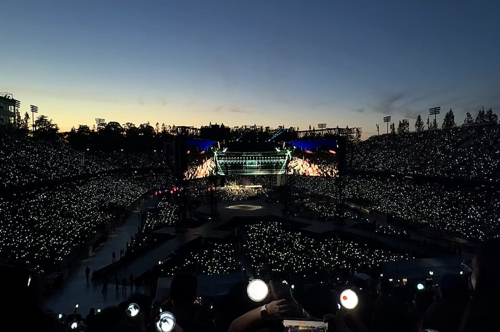
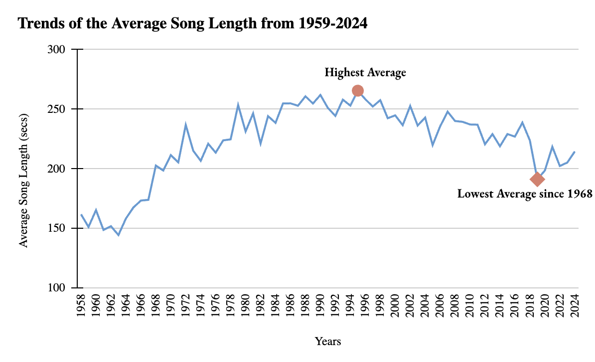
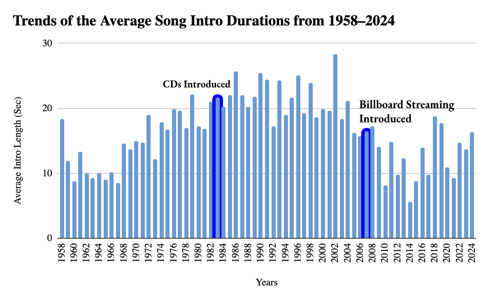
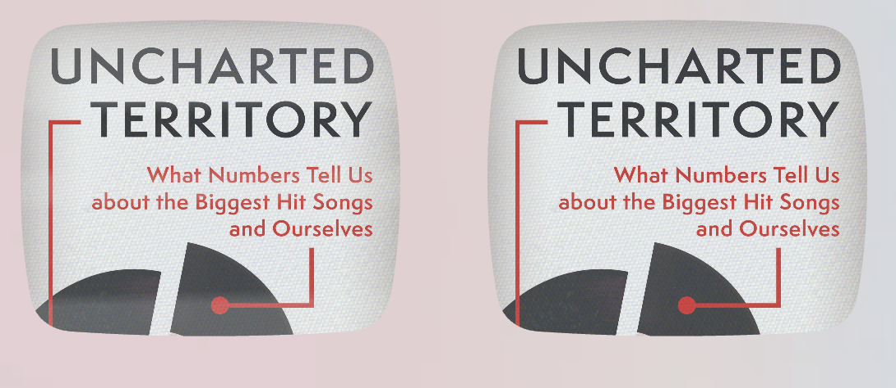
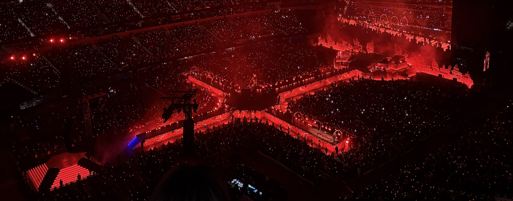

# How Streaming and Chart Trends Impacted the Runtime of Modern Hit Songs

As the music industry transitioned from the vinyl-dominated era in the 1970s to the CD-dominated era in the 1980s and '90s, artists suddenly had the flexibility to have extensive albums over vinyls; furthermore, the price was solid no matter the length, allowing songwriters to experiment with long intros and extended runtimes.

As the industry shifted toward streaming in the late 2000s, the measurement of success and profit was measured through the counts of how many times a user listened to a song for over 30 seconds.
This means the procedure of platforms paying per stream gives favor to shorter songs since listeners can rack up more total plays and money in a shorter amount of time.
Not only is there financial beneift, but Billboard charts highly rely on streaming, in which higher amounts of recognized plays helps the song climb up the charts pretty quickly. 

## The Rise from CDs and Dip from Streaming 

Checking the peak, the highest average song length of 260 seconds was in 1996, right when CDs were starting to get popular worldwide. As vinyls were getting out of trend, fans would need to buy CDs in order to listen to an artist's new album, allowing the artist full freedom in what they can create. 

As the timeline approchaes the late 2000s, the trend starts to decline and hitting its lowest average since 1968 in 2019, right before COVID hit. Many people were still commuting and working, prioritizing shorter songs that can quickly loop. As everyone started quaratining and finding more time to listen, they were able to sit back and listen to longer tracks and become more involved with songs; therefore, explaining the short rise within 2020-2022. 

## And the Intro Matters 

The total runtime only covers a half of this analysis, as for a stream to even be accurately recorded, a listner must listen for over 30 seconds. In order for a listener to even commit to listening, the intro must serve as a good hook, in which is often a shorter intro. Again with the popular rise and songwriter freedom, instrumental intros steadily grew, peaking at a massive 28 seconds in 2002.

As the Billboard streaming get introduced in 2007, the trends starts to drop, quickly getting to 6 seconds in 2014. There was a small rise again from 2016-2020, in which the popular genres like Hip-Hop and Rn&B utilized repetive beat loops in the intro to set a vibe for playlisting. This also connects to the rise in popularity iin lofi and chill rap playlists for people to listen to a list easily.    

## The Data Behind the Music

While this dataset came from the Data Is Plural archive, a product manager at Audiomack, Chris Dalla Riva, who is also a musician, compiled this data for his book [Uncharted Territory: What Numbers Tell Us about the Biggest Hit Songs and Ourselves](https://bio.site/uncharted_territory). He built this workbook by combining historical chart data and and deep audio metadata primarly from the Spotify Developer API. His intention for this was for investigative analysis on finding the different trends rather than commercial marketing of promoting to continously have songwriters that have short songs.

(Source: Bio Sites) 

However, this data only holds songs from the Billboard Hot 100, focusing entirley on the most streamed songs that hit the top of the chart each week. The focus is on the peak of commercial success of each number one song, and not representing independent or non-charting music. 

Also, the tracking metrics for how long an intro is varies by each listner's opinion as well as professional musicologists, as the data was gathered from an automated algorithmic detection within Spotify. People may assume the intro ends a lot earlier or later depending on their defintion of where the main section is. 

## The Bottom Line

Modern hit songs are reengineering every year to survive the the streaming economy as well as success in the music industry. Also, as the industry shifted fron vinyls to CDs to streaming, algorithmic playlists and long runtimes became financial liabilities to both the artist (and their company). Especially in a digital world that relies a lot on social media, the pressure to hook listeners within the first few seconds as well as maximize loops shapes everything from the length of the intro and overall runtime. 

Note: My copy of the [Billboard Dataset](https://docs.google.com/spreadsheets/d/1eP-VmP2D9e-FQYfVEZ4y333biUpOIAvfaZubeccDp3M/edit?usp=sharing) contains every song to ever top the Billboard Hot 100 between August 4, 1958 and January 11, 2025; however, there was only one song recorded for 2025. For that reason, the analysis and data visulizations was adjusted to only cover the data from August 1958- December 2024. 
